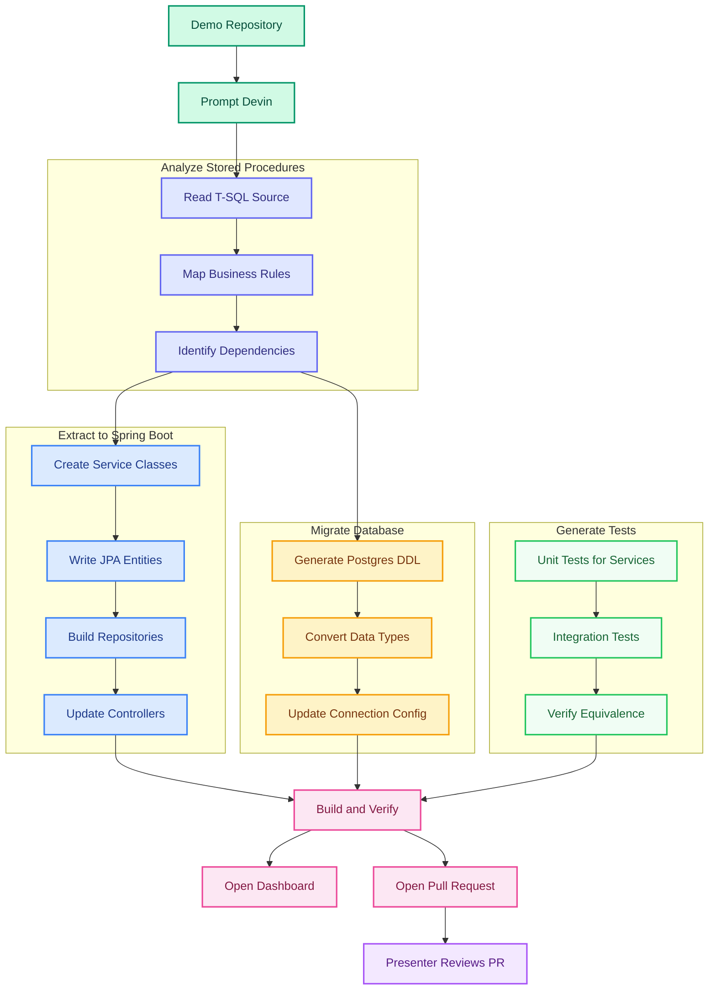
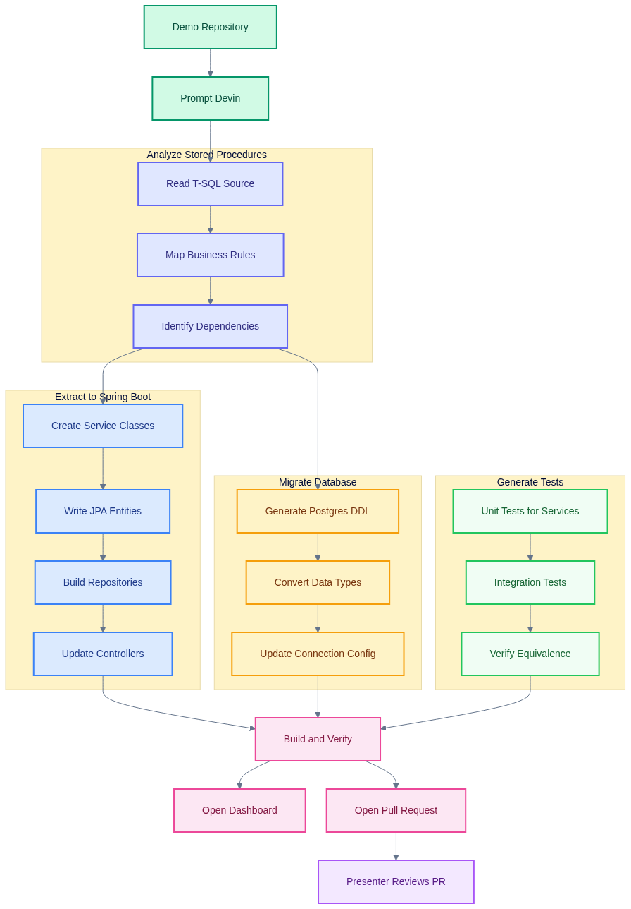

# SQL Server to PostgreSQL Migration Demo


## Demo Workflow

> Extract stored procedure business logic into Spring Boot services, migrate to PostgreSQL, generate tests.
> For the full interactive version, see [`docs/flowchart.html`](docs/flowchart.html).



<details><summary>Flowchart (PNG fallback)</summary>



</details>

---

## What This Demo Shows

A large auto manufacturer has accumulated **15+ years of business logic** inside SQL Server stored procedures — warranty claim processing, VIN decoding, parts supersession lookups, supplier quality scoring, dealer settlement calculations. These stored procedures are undocumented, untested, and tightly coupled to SQL Server. The company wants to migrate to PostgreSQL on GCP and move all stored procedure logic into the Spring Boot application layer.

This demo proves that Devin can analyze undocumented stored procedures, extract the business logic into properly structured Spring Boot services, migrate the database schema to PostgreSQL, and generate comprehensive tests — all in a single live session.

## What Devin Does Live

Devin reads each of the 6 stored procedures in `sql_server_source/`, reverse-engineers the business rules (warranty coverage priority, dealer region mapping, parts supersession chain walking, supplier scoring weights, settlement markup rules, VIN check-digit validation), extracts them into Spring Boot service classes with JPA repositories, generates PostgreSQL-compatible DDL in `postgres_target/` (simple CRUD tables — no stored procedures), writes unit and integration tests, updates the app configuration, and opens a PR with the complete migration. The dashboard at `localhost:8080` continues to work against the new architecture.

## How the Demo Runs

1. Presenter opens the repo and walks through the stored procedures, highlighting the undocumented business logic
2. Presenter prompts Devin in a fresh session with the migration instructions
3. Devin analyzes all 6 stored procedures, extracts the business rules, creates Spring Boot services, generates Postgres DDL and tests
4. Devin runs `mvn verify` to confirm everything builds and tests pass
5. Devin opens a PR with the complete migration diff
6. Presenter reviews the PR, runs the app, and shows the dashboard still works

### Local Development

```bash
cd spring-boot-app
mvn spring-boot:run
# Dashboard:   http://localhost:8080/
# Swagger UI:  http://localhost:8080/swagger-ui.html
# H2 Console:  http://localhost:8080/h2-console (JDBC URL: jdbc:h2:mem:vehicleops)
```

---

## Repo Layout

```
sqlserver-postgres-migration-demo/
├── sql_server_source/                    ← Original T-SQL stored procedures (6 files)
│   ├── tables/schema.sql                 ← Table definitions
│   ├── sp_process_warranty_claim.sql     ← Warranty claim validation + processing
│   ├── sp_vehicle_production_status.sql  ← Production tracking + bottleneck detection
│   ├── sp_parts_supersession.sql         ← Parts chain lookup + fitment validation
│   ├── sp_supplier_quality_scorecard.sql ← Supplier scoring + trend analysis
│   ├── sp_dealer_settlement.sql          ← Dealer reimbursement calculation
│   └── fn_decode_vin.sql                 ← VIN decoder (SAE J853 / ISO 3779)
│
├── spring-boot-app/                      ← Legacy Spring Boot app (calls SPs via JdbcTemplate)
│   ├── pom.xml                           ← Spring Boot 2.7.18, Java 8
│   ├── src/main/java/.../controller/     ← REST + dashboard controllers
│   ├── src/main/java/.../repository/     ← Thin wrappers that call stored procedures
│   ├── src/main/java/.../service/        ← Mostly empty — logic lives in the SPs
│   ├── src/main/java/.../model/          ← JPA entities
│   └── src/main/resources/               ← H2 schema, seed data, Thymeleaf dashboard
│
├── postgres_target/                      ← Empty — Devin writes migrated DDL here
├── docs/                                 ← Flowchart + implementation plan
└── .github/workflows/ci.yml             ← Build + test
```

---

## Key Concepts

| Term | Description |
|---|---|
| **Stored Procedure (SP)** | T-SQL code block running inside SQL Server with embedded business logic |
| **VIN** | Vehicle Identification Number — 17 chars per SAE J853 / ISO 3779 |
| **Supersession Chain** | Part A → Part B → Part C replacement lineage |
| **Coverage Type** | Warranty tier: bumper-to-bumper, powertrain, emissions, corrosion |
| **PPM** | Parts Per Million — supplier defect rate metric |
| **Dealer Settlement** | Reimbursement batch processing for warranty work |
| **Parts Markup** | Dealer cost-plus calculation: OEM 40%, reman 25%, aftermarket 15% |
| **Check Digit** | VIN position 9 validation (mod-11 algorithm) |
| **NOLOCK** | SQL Server hint for dirty reads (no PostgreSQL equivalent needed) |
| **JdbcTemplate** | Spring's low-level JDBC abstraction used to call SPs |
